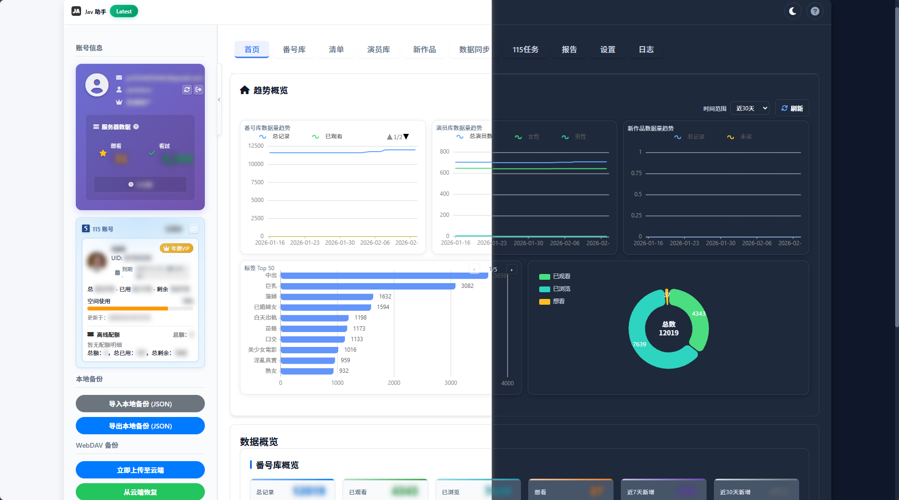
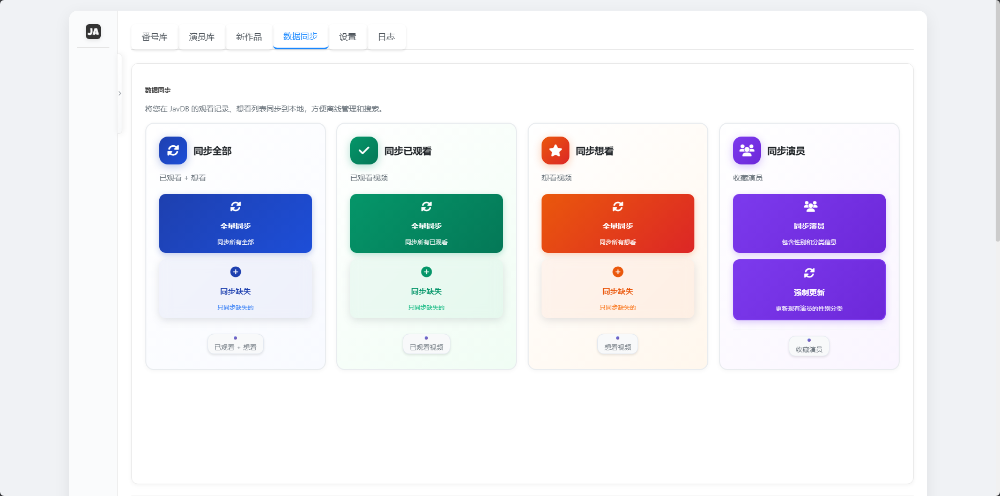
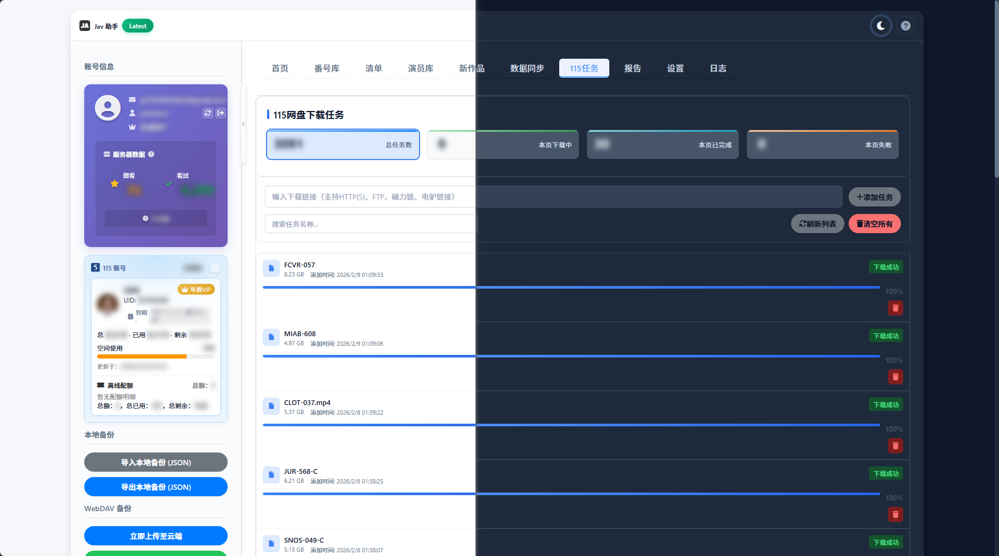
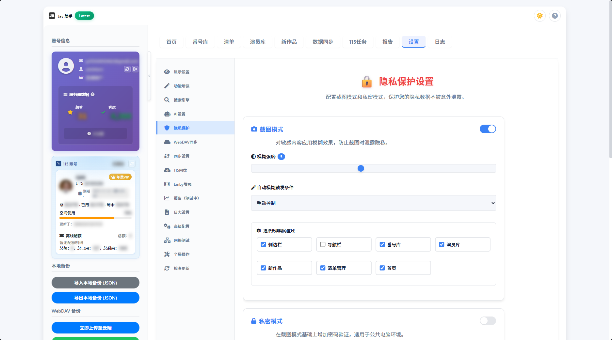
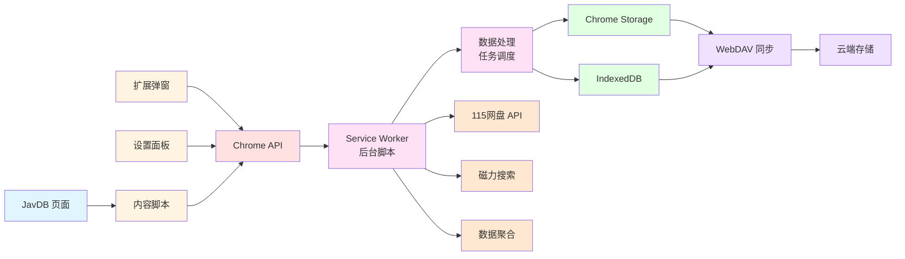

# JavdBviewed

<div align="center">


**Jav 视频浏览助手**

[](https://github.com/Adsryen/JavdBviewed/releases)
[](LICENSE)
[](https://github.com/Adsryen/JavdBviewed/releases)

</div>

## 📖 简介

Jav 助手是一个功能强大的浏览器扩展，专为 JavDB 等Jav视频网站设计。它能够在列表页和详情页标记视频的"已浏览"或"我看过"状态，并提供丰富的数据管理功能，包括 WebDAV 同步、数据导入导出、115网盘推送等高级特性。

---
### ⭐ 如果您觉得这个项目对您有帮助，请给它一个 Star！

**您的支持是我持续维护和改进的最大动力 💪**

---

> **⚠️ 重要提示**
> 
> 本扩展仅供**年满18周岁的成年用户**使用。
> 
> - 🔞 本扩展涉及的内容相关功能，请确保您已达到所在地区的法定成年年龄
> - 🚫 请勿在未成年人可访问的设备上安装或使用本扩展
> - 🔒 建议启用扩展内置的隐私保护功能，保护个人隐私
> 
> **开发者不对用户的使用行为承担任何责任，请合法合规使用。**

## ✨ 核心功能

- 🎯 **视频标记** - 已浏览、已观看、想看三种状态标记，智能优先级显示
- 📚 **数据管理** - 番号库、演员库管理，支持导入导出和统计分析
- ☁️ **云端同步** - WebDAV 自动同步，支持多设备数据一致性
- 💾 **115网盘** - 一键推送磁力链接，自动验证和标记
- 🎨 **页面增强** - 列表预览、详情增强、智能过滤和隐藏
- 👥 **演员管理** - 演员收藏、订阅、黑名单和智能过滤
- 🆕 **新作品监控** - 自动检测新作品，智能过滤和批量操作
- 🔍 **磁力搜索** - 多源自动搜索，支持自定义搜索引擎
- 🔒 **隐私保护** - 截图模糊模式，保护敏感信息
- 📊 **数据分析** - 观看统计和可视化报告（测试中）
- 🎬 **Emby增强** - Emby服务器集成和快捷跳转
- 🤖 **AI翻译** - 支持多种AI模型的内容翻译

> 📖 **查看完整功能清单**: [FEATURES.md](FEATURES.md) - 包含所有功能的详细说明和状态

## 🖼️ 界面预览（以实际为准，不会及时更新）

### 番号库管理
<div align="center">

<p><em>番号库 - 管理和查看已标记的视频番号</em></p>
</div>

### 演员库管理
<div align="center">

<p><em>演员库 - 演员信息管理和分类功能</em></p>
</div>

### 新作品监控
<div align="center">

<p><em>新作品 - 自动监控和订阅感兴趣的新发布内容</em></p>
</div>

### 数据同步功能
<div align="center">

<p><em>数据同步 - WebDAV 云端同步，多设备数据一致性保障</em></p>
</div>

### 扩展设置面板
<div align="center">

<p><em>设置面板 - 完整的配置选项和功能开关</em></p>
</div>

### 操作日志记录
<div align="center">

<p><em>日志面板 - 详细的操作记录和系统状态信息</em></p>
</div>

## 📦 安装方式

### 前置要求

- **基本功能**: 支持 Chrome、Edge 等基于 Chromium 的浏览器
- **115网盘功能**: 需要已登录的115网盘账号（在 https://115.com 登录）

### 方式一：下载预编译版本（推荐）

> **📢 关于 Chrome 应用商店发布说明**
> 
> 根据 Chrome Web Store 开发者计划政策第 2.7 条规定：
> 
> > **2.7 Adult Content**  
> > *The extension contains content that is pornographic or sexually explicit.*  
> > （扩展包含色情或性暗示内容）
> 
> 
> 用户需要通过以下方式手动安装本扩展。在 GitHub Releases 页面提供最新版本的更新。

**安装步骤：**

1. 访问 [Releases 页面](https://github.com/Adsryen/JavdBviewed/releases)
2. 下载最新版本的 `javdb-extension-v*.zip` 文件
3. 解压到本地文件夹
4. 打开浏览器扩展管理页面：
   - Chrome: `chrome://extensions/`
   - Edge: `edge://extensions/`
5. 开启"开发者模式"
6. 点击"加载已解压的扩展程序"，选择解压后的文件夹

### 方式二：油猴脚本版本（停止维护）

1. 安装 [Tampermonkey](https://www.tampermonkey.net/) 扩展
2. 下载 `Tampermonkey/javdb.js` 文件
3. 在 Tampermonkey 管理面板中导入脚本

## 📚 使用说明

### 基本操作

#### 标记视频状态
1. **在列表页**: 点击视频项目上的标记按钮
2. **在详情页**: 使用页面上的快速操作按钮
3. **批量操作**: 在设置面板中进行批量管理

#### 设置同步
1. 点击扩展图标打开弹窗
2. 点击"设置"进入设置面板
3. 在"数据同步"选项卡中配置 WebDAV
4. 输入服务器地址、用户名和密码
5. 点击"测试连接"验证配置
6. 启用自动同步

#### 115网盘推送
1. **启用功能**: 设置面板 → 115网盘 → 启用115网盘功能
2. **配置设置**: 设置下载目录和其他选项
3. **推送磁链**: 在视频详情页点击磁力链接旁的"推送115"按钮
4. **自动标记**: 推送成功后视频会自动标记为已观看

#### 数据管理
- **导出数据**: 设置面板 → 数据管理 → 导出数据
- **导入数据**: 设置面板 → 数据管理 → 导入数据
- **查看统计**: 设置面板 → 统计信息

## 🛠️ 二次开发指南

### 开发环境准备

#### 系统要求
- Node.js 18+
- npm 或 pnpm
- Git

#### 克隆项目
```bash
git clone https://github.com/Adsryen/JavdBviewed.git
cd JavdBviewed
```

### 项目结构

```
JavdBviewed/
├── src/                      # 源代码
│   ├── background/           # Service Worker 后台脚本
│   ├── content/              # 内容脚本 (注入到页面)
│   ├── popup/                # 扩展弹窗界面
│   ├── dashboard/            # 设置面板
│   ├── services/             # 业务服务层
│   ├── components/           # 可复用组件
│   ├── utils/                # 工具函数
│   ├── types/                # TypeScript 类型定义
│   └── assets/               # 静态资源
├── scripts/                  # 构建脚本
├── dist/                     # 编译输出目录
├── docs/                     # 项目文档
├── todo/                     # 开发计划和待办事项
├── Tampermonkey/             # 油猴脚本版本（已停止维护）
└── reference/                # 参考资料
```

### 开发流程

#### 1. 安装依赖
```bash
npm install
# 或使用 pnpm
pnpm install
```

#### 2. 开发模式
```bash
# 构建开发版本
npm run build

# 监听文件变化并自动重新构建
npm run dev  # 如果有此命令
```

#### 3. 加载扩展进行测试
1. 构建完成后，`dist` 目录包含可加载的扩展文件
2. 在浏览器中加载 `dist` 目录作为未打包的扩展
3. 修改源代码后重新运行 `npm run build`
4. 在扩展管理页面点击刷新按钮

#### 4. 打包发布
```bash
# 创建发布版本的 zip 包
npm run build
```
打包后的文件位于 `dist-zip/` 目录中。


### 常见问题

#### Q: 扩展安装后没有反应？
A: 请确保在扩展管理页面开启了"开发者模式"，并且扩展已启用。刷新 JavDB 页面后即可生效。

#### Q: WebDAV 同步失败怎么办？
A: 请检查服务器地址、用户名和密码是否正确，建议先点击"测试连接"验证配置。确保 WebDAV 服务器支持 CORS 跨域访问。

#### Q: 115网盘推送失败？
A: 请确保已在 https://115.com 登录账号，并在扩展设置中启用了115网盘功能。如遇验证码，请完成验证后重试。

#### Q: 标记的视频在其他设备上看不到？
A: 需要配置 WebDAV 同步功能，并在所有设备上启用自动同步。首次同步可能需要几分钟时间。

#### Q: 如何备份我的数据？
A: 在设置面板的"数据管理"选项卡中，点击"导出数据"按钮，会下载一个 JSON 格式的备份文件。

#### Q: 扩展占用内存太大？
A: 可以在设置中关闭不需要的功能，或定期清理历史数据。如果数据量很大，建议导出备份后清空部分旧数据。

### 架构说明




### 贡献指南

1. Fork 本项目
2. 创建功能分支: `git checkout -b feature/new-feature`
3. 提交更改: `git commit -am 'Add new feature'`
4. 推送分支: `git push origin feature/new-feature`
5. 提交 Pull Request

### 版本发布

1. 更新版本号：
   ```bash
   npm version patch  # 或 minor, major
   ```
2. 构建发布版本：
   ```bash
   npm run build
   ```
3. 创建 GitHub Release 并上传 zip 文件

## � 开发计划

查看详细的开发计划和待办事项：[Todo 计划](todo/todo.md)

### 近期重点

- 🔐 **115 功能优化**: refreshtoken 自动刷新机制
- ⚡ **功能增强**: 智能内容过滤、磁力资源搜索优化
- 🆕 **新作品管理**: 批量操作和智能过滤
- ☁️ **WebDAV 改进**: 备份预警和自动上传修复
- 🎬 **番号库增强**: 一键标记和状态同步

## 📄 许可证

本项目采用 [GPL-3.0](LICENSE) 许可证。

## 🤝 支持与反馈

如有问题或建议，欢迎通过以下方式联系：
- 💬 提交 [Issue](https://github.com/Adsryen/JavdBviewed/issues) - 报告问题或提出功能建议
- 🗨️ 发起 [Discussion](https://github.com/Adsryen/JavdBviewed/discussions) - 参与讨论和交流

---

<div align="center">

### ⭐ 如果您觉得这个项目对您有帮助，请给它一个 Star！

**您的支持是我持续维护和改进的最大动力 💪**

[](https://star-history.com/#Adsryen/JavdBviewed&Date)

</div>